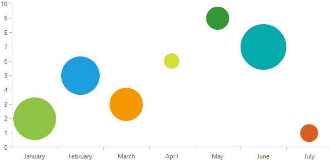

Hey there, 👋 I'm Asma, and I'm all about creating awesome stuff as a Django REST API and C# Developer. How cool is that?

Get ready to be blown away by my GitHub profile! I'm a master when it comes to building robust Django REST APIs and crafting slick applications using C#. Brace yourself for some jaw-dropping action!

<!--  -->

But wait, there's more! I'm not just a one-trick pony. I'm a C# wizard, especially when it comes to ASP.NET and WPF

<!--  -->
<!-- 
     -->

Now, let me introduce myself properly. I'm a passionate developer with a crazy amount of expertise in Django (Well just enough to do it properly), Python, C#, ASP.NET, and WPF. My mission? Creating efficient, user-friendly applications that solve real-world problems. Boom!

Here's a quick rundown of some of my mad skills and the technologies I dominate:

- Django REST Framework: I make REST APIs dance to my tunes.
- Python: My coding language of choice for unleashing awesomeness.
- C# and .NET Framework: I bend them to my will and make magic happen.
- ASP.NET: Building cool web applications? You bet!
- WPF (Windows Presentation Foundation): Creating stunning desktop apps with style.
- Entity Framework: Taming databases like a pro.
- SQL: Manipulating data like nobody's business.
- HTML, CSS, JavaScript: The trio that brings life to the web.

Excited yet? I sure am! If you're ready to join forces and create something epic, let's connect! Drop me a line through any of these channels:

- Email: asma.aha666@gmail.com
- LinkedIn: [Asma](https://www.linkedin.com/in/hamza-asma-b044541b6/)
- Twitter: [@Asma_HH_](https://twitter.com/Asma_HH_)

I'm all ears for thrilling collaboration opportunities and exciting new projects. Together, we can unleash our creativity and make the world go, Let's do this!